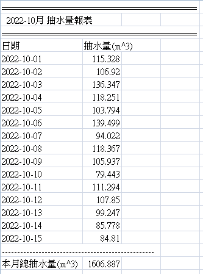
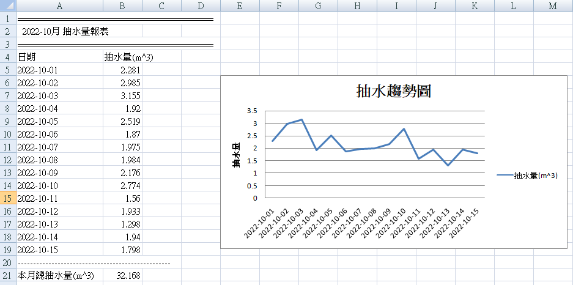

# Python 操作 Excel

參考書籍：https://www.books.com.tw/products/0010929648?sloc=main&fbclid=IwAR3WkypWSKq3fN-pQqlgGJf7_IGrSNFoPjbNyTFyglDJYjwv-uNX8uQToRo

----

## 這邊是我最近剛好會用到的功能，剛好有書可以參考，先寫一篇範例記錄一下，比較不會忘記

### 首先，這是一個抽水機抽水量資料的報表匯出功能，從SQL匯出資料後，原先使用csv檔存

- 我們的資料大概長以下的樣子，我的報表功能是寫在flask做的網頁後台，所以最後會return一個檔案回去


- 我本來是以csv檔匯出資料，不過office2010以後會有個問題utf8的格式，會直接用big5解，所以會有一堆亂碼，用big5存就不會有問題
- (但是這問題在openoffice, libreoffice都不會是個問題....無言)
- 我的程式長這樣：
```python
        flow_volume_d_list = my_data_dict[sid]['flow_volume_d_list']
        day_list = my_data_dict[sid]['day_list']
        flow_volume_m = my_data_dict[sid]['flow_volume_m']
        #flow_volume_today = my_data_dict[sid]['flow_volume_today']
        name = my_data_dict[sid]['name']

        fn = '%s_%s.csv' %(sid, yyyymm)
        # 用utf-8時excel打開會有亂碼
        #with open(fn, 'w', newline='', encoding="utf-8") as csvfile:
        with open(fn, 'w', newline='', encoding="big5") as csvfile:
            writer = csv.writer(csvfile)

            writer.writerow(['=================================================='])
            writer.writerow(['  %s-%s %s月 抽水量報表' %(sid, name, yyyymm)])
            writer.writerow(['=================================================='])

            writer.writerow(['日期', '抽水量(m^3)'])
            for k in range(len(day_list)):
                dtime = day_list[k]
                flow_volume = flow_volume_d_list[k]
                writer.writerow([dtime, flow_volume])
            
            writer.writerow(['--------------------------------------------------'])
            writer.writerow(['本月總抽水量(m^3)', flow_volume_m])
        return send_file(fn, mimetype='text/csv', attachment_filename=fn,as_attachment=True)
```

### 改用excel後
- 程式變這樣，其實沒有比較難寫
- 只是一開始要先引入一個新的module: openpyxl, 沒安裝過，就用`pip install openpyxl`即可
- 這邊使用append是使用list的方式寫入資料，跟csv很像!!
```py
import openpyxl
from openpyxl.chart import LineChart, Reference

#...
        flow_volume_d_list = my_data_dict[sid]['flow_volume_d_list']
        day_list = my_data_dict[sid]['day_list']
        flow_volume_m = my_data_dict[sid]['flow_volume_m']
        name = my_data_dict[sid]['name']

        wb = openpyxl.Workbook()
        ws = wb.active
        ws.title = '月抽水量報表'
        #寫入資料
        ws.append(['="========================================"'])
        ws.append(['  %s-%s %s月 抽水量報表' %(sid, name, yyyymm)])
        ws.append(['="========================================"'])
        ws.append(['日期', '抽水量(m^3)'])
        for k in range(len(day_list)):
            dtime = day_list[k]
            flow_volume = flow_volume_d_list[k]
            ws.append([dtime, flow_volume])
        ws.append(['="--------------------------------------------------"'])
        ws.append(['本月總抽水量(m^3)', flow_volume_m])

        #存檔
        fn = '%s_%s.xlsx' %(sid, yyyymm)
        wb.save(fn)
        return send_file(fn, mimetype='text/xlsx', attachment_filename=fn,as_attachment=True)
```

### 寫入Excel檔的另一種寫法
- 這一個寫法在書中有介紹到，不過目前倒是沒有很適合我的情境
- 比較合適的情境應該是我以前曾經做過的：excel的樣版檔格式已經做好了，資料填入就可以印報表使用，這時指定row, column的方式將會很方便!!
```py
        flow_volume_d_list = my_data_dict[sid]['flow_volume_d_list']
        day_list = my_data_dict[sid]['day_list']
        flow_volume_m = my_data_dict[sid]['flow_volume_m']
        name = my_data_dict[sid]['name']

        wb = openpyxl.Workbook()
        ws = wb.active
        ws.title = '月抽水量報表'
        #寫入資料
        ws.cell(row=1, column=1, value='="========================================"')
        ws.cell(row=2, column=1, value='  %s-%s %s月 抽水量報表' %(sid, name, yyyymm))
        ws.cell(row=3, column=1, value='="========================================"')
        ws.cell(row=4, column=1, value='日期')
        ws.cell(row=4, column=2, value='抽水量(m^3)')
        idx = 5
        for k in range(len(day_list)):
            dtime = day_list[k]
            flow_volume = flow_volume_d_list[k]
            ws.cell(row=idx+k, column=1, value=dtime)
            ws.cell(row=idx+k, column=2, value=flow_volume)
        idx += len(day_list)
        ws.cell(row=idx, column=1, value='="--------------------------------------------------"')
        idx+=1
        ws.cell(row=idx, column=1, value='本月總抽水量(m^3)')
        ws.cell(row=idx, column=2, value=flow_volume_m)

        #存檔
        fn = '%s_%s.xlsx' %(sid, yyyymm)
        wb.save(fn)
        return send_file(fn, mimetype='text/xlsx', attachment_filename=fn,as_attachment=True)

```

### 最後，我再把抽水量的趨勢圖一併整合到excel中，這是在csv檔中做不到的事情
- 程式會長這個樣子
```py
        flow_volume_d_list = my_data_dict[sid]['flow_volume_d_list']
        day_list = my_data_dict[sid]['day_list']
        flow_volume_m = my_data_dict[sid]['flow_volume_m']
        name = my_data_dict[sid]['name']

        wb = openpyxl.Workbook()
        ws = wb.active
        ws.title = '月抽水量報表'
        #寫入資料
        ws.append(['="========================================"'])
        ws.append(['  %s-%s %s月 抽水量報表' %(sid, name, yyyymm)])
        ws.append(['="========================================"'])
        ws.append(['日期', '抽水量(m^3)'])
        for k in range(len(day_list)):
            dtime = day_list[k]
            flow_volume = flow_volume_d_list[k]
            ws.append([dtime, flow_volume])
        ws.append(['="--------------------------------------------------"'])
        ws.append(['本月總抽水量(m^3)', flow_volume_m])
        #插入圖
        data = Reference(ws, min_col=2, max_col=2, min_row=4, max_row=19)
        chart = LineChart()
        chart.add_data(data, titles_from_data=True)
        chart.title = '抽水趨勢圖'
        chart.x_axis.tilte = '時間'
        chart.y_axis.title = '抽水量'
        xtitle = Reference(ws, min_col=1, min_row=5, max_row=19)
        chart.set_categories(xtitle)
        ws.add_chart(chart, 'E6')

        #存檔
        fn = '%s_%s.xlsx' %(sid, yyyymm)
        wb.save(fn)
        return send_file(fn, mimetype='text/xlsx', attachment_filename=fn,as_attachment=True)

```
- 產生的結果如下，效果還真的不錯：


